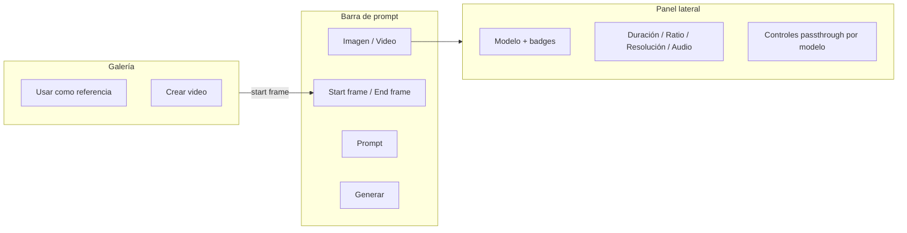
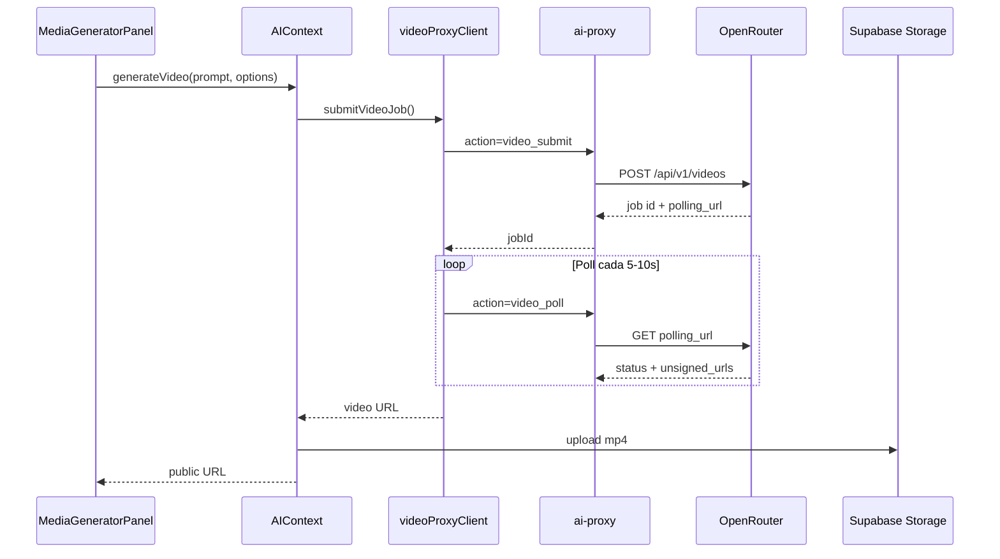

# Plan: Generador unificado de Imagen y Video (OpenRouter)

## Contexto actual

- El generador vive en [`ImageGeneratorPanel.tsx`](QuimeraAi/components/ui/ImageGeneratorPanel.tsx) (~1400 líneas): modelos de imagen vía OpenRouter en [`ai-proxy`](QuimeraAi/supabase/functions/ai-proxy/index.ts) + [`generateImageViaProxy`](QuimeraAi/utils/geminiProxyClient.ts) + [`AIContext.generateImage`](QuimeraAi/contexts/ai/AIContext.tsx).
- **No existe generación de video** en el codebase.
- Admin usa el mismo panel en [`UnifiedMediaLibrary.tsx`](QuimeraAi/components/dashboard/admin/UnifiedMediaLibrary.tsx) (`destination="admin"`), pero sin `adminCategory` ligado a la carpeta activa.
- Usuario confirmó: **lista curada de 3 modelos** — Seedance 2.0, Google Veo 3.1 y Gemini Omni — con controles dinámicos según capacidades de cada modelo vía OpenRouter `/api/v1/videos/models`.

## Referencia UX: Leonardo AI

Patrones a replicar (sin copiar UI literal):



- Toggle **Imagen | Video** arriba del prompt (como Leonardo).
- Selector de modelo con **badges de capacidad**: audio, start frame, end frame, duraciones soportadas.
- **Start frame / End frame** separados de **input_references** (referencias de estilo/personaje).
- Acción **"Crear video"** desde imágenes generadas o galería → abre modo video con start frame pre-cargado.
- Generación **asíncrona** con barra de progreso y polling (videos tardan minutos).

---

## Arquitectura propuesta



### 1. Backend — extender `ai-proxy`

Archivo: [`QuimeraAi/supabase/functions/ai-proxy/index.ts`](QuimeraAi/supabase/functions/ai-proxy/index.ts)

Nuevas acciones (campo `action` en el body):

| Acción | OpenRouter | Propósito |
|--------|-----------|-----------|
| `video_models` | `GET /api/v1/videos/models` | Capacidades + `allowed_passthrough_parameters` |
| `video_submit` | `POST /api/v1/videos` | Crear job |
| `video_poll` | `GET {polling_url}` | Estado del job |

**Modelos curados** (whitelist en [`curatedVideoModels.ts`](QuimeraAi/constants/curatedVideoModels.ts); filtrar respuesta de OpenRouter):

| Modelo UI | OpenRouter ID (esperado) | Notas |
|-----------|---------------------------|-------|
| **Seedance 2.0** | `bytedance/seedance-2.0` | Text-to-video, image-to-video, first/last frame, referencias multimodales; fuerte en consistencia de personaje |
| **Google Veo 3.1** | `google/veo-3.1` | Máxima fidelidad 1080p, audio nativo, start/end frame, extensiones de escena |
| **Gemini Omni** | `google/gemini-omni-flash` *(resolver al implementar)* | Multimodal (texto, imagen, audio, video como input); edición conversacional en Gemini app; **aún no listado en OpenRouter video API** — resolver slug en runtime con `GET /videos/models` (match por `omni` / `gemini-omni`) y mostrar como "Próximamente" si no está disponible |

**Resolución dinámica del slug Omni:** en `video_models`, buscar el primer modelo cuyo `id` o `name` contenga `omni` dentro del namespace `google/*`. Si no existe, el selector lo muestra deshabilitado con badge "Próximamente" hasta que OpenRouter lo publique (Google anunció rollout a developers "en las próximas semanas").

**Eliminados de v1** (no solicitados): `seedance-2.0-fast`, `seedance-1-5-pro`, `veo-3.1-fast`, `veo-3.1-lite`.

Mapeo de parámetros normalizados OpenRouter:

- `prompt`, `duration`, `resolution`, `aspect_ratio`, `size`
- `generate_audio`, `seed`
- `frame_images[]` → `{ frame_type: 'first_frame' | 'last_frame', image_url | base64 }`
- `input_references[]` → referencias de estilo
- `provider.options['google-vertex'].parameters` → passthrough dinámico (`negativePrompt`, `personGeneration`, `enhancePrompt`, etc.)

Reutilizar helpers existentes de [`imageInputToUrl`](QuimeraAi/supabase/functions/ai-proxy/index.ts) para normalizar imágenes de frames/referencias.

**Diferencias clave por modelo (controles dinámicos):**

- **Seedance 2.0:** referencias multimodales (`input_references`), first/last frame, fuerte en movimiento de cámara y consistencia visual.
- **Veo 3.1:** audio nativo (`generate_audio`), duraciones 4/6/8s, passthrough Vertex (`negativePrompt`, `personGeneration`, `enhancePrompt`), first/last frame.
- **Gemini Omni:** cuando esté en OpenRouter, esperar soporte ampliado de inputs (imagen + audio + video como referencia); exponer todos los parámetros que devuelva `allowed_passthrough_parameters` para ese slug.

### 2. Cliente y tipos

**Nuevos archivos:**

- [`QuimeraAi/types/videoGeneration.ts`](QuimeraAi/types/videoGeneration.ts) — `VideoGenerationOptions`, `VideoJobStatus`, `VideoModelCapabilities`
- [`QuimeraAi/constants/curatedVideoModels.ts`](QuimeraAi/constants/curatedVideoModels.ts) — IDs curados + labels/credit tier
- [`QuimeraAi/utils/videoProxyClient.ts`](QuimeraAi/utils/videoProxyClient.ts) — `fetchVideoModels()`, `submitVideoJob()`, `pollVideoJobUntilComplete()`
- [`QuimeraAi/hooks/useVideoModels.ts`](QuimeraAi/hooks/useVideoModels.ts) — cache de capacidades por modelo (invalidar al cambiar modelo)
- [`QuimeraAi/hooks/useVideoGeneration.ts`](QuimeraAi/hooks/useVideoGeneration.ts) — estado async: submitting → polling → done/error, con cancelación

**Extender [`AIContext.tsx`](QuimeraAi/contexts/ai/AIContext.tsx):**

- `generateVideo(prompt, options)` — análogo a `generateImage`: descarga MP4 desde `unsigned_urls`, sube a Supabase Storage, persiste en librería (`user` / `admin` / `global`) con `type: 'video/mp4'`.
- Reutilizar lógica de `uploadGeneratedImageBlob` → extraer `uploadGeneratedMediaBlob` genérico.

### 3. UI — `MediaGeneratorPanel`

**Nueva carpeta:** `QuimeraAi/components/media-generator/`

| Archivo | Rol |
|---------|-----|
| `MediaGeneratorPanel.tsx` | Shell unificado: header, mode toggle, preview, persistencia |
| `ImageGenerationSection.tsx` | Extraer lógica actual de `ImageGeneratorPanel` |
| `VideoGenerationSection.tsx` | Controles video + job progress |
| `shared/MediaModeToggle.tsx` | Imagen / Video |
| `shared/FrameImagePicker.tsx` | Start / End frame (Leonardo) |
| `shared/ReferenceImagePicker.tsx` | Referencias + biblioteca + imágenes recién generadas |
| `shared/ModelSelectorWithBadges.tsx` | Modelo + badges de capacidad |
| `shared/DynamicPassthroughControls.tsx` | Renderiza campos desde `allowed_passthrough_parameters` |
| `shared/GeneratedMediaPreview.tsx` | Preview imagen o `<video>` |
| `MediaGeneratorModal.tsx` | Wrapper modal (reemplaza lógica de `ImageGeneratorModal`) |

**Props clave** (invocable en distintos contextos):

```typescript
interface MediaGeneratorPanelProps {
  destination: 'user' | 'global' | 'admin';
  defaultMode?: 'image' | 'video';
  allowedModes?: ('image' | 'video')[];
  initialStartFrame?: string;
  initialEndFrame?: string;
  adminCategory?: string;
  onImageGenerated?: (url: string) => void;
  onVideoGenerated?: (url: string) => void;
  onUseImage?: (url: string) => void;
  onUseVideo?: (url: string) => void;
  // ... props existentes (hideHeader, projectId, generationContext)
}
```

**Controles video (dinámicos por modelo):**

| Control | Fuente | Comportamiento |
|---------|--------|----------------|
| Duración | `supported_durations` del modelo | Select; ocultar si no soportado |
| Aspect ratio | `supported_aspect_ratios` | Select filtrado |
| Resolución / size | `supported_resolutions` | Select; `size` solo si el modelo lo expone |
| Audio | `generate_audio` capability | Toggle |
| Seed | capability flag | Input numérico opcional |
| Start / End frame | `frame_images` support | `FrameImagePicker` con upload + galería + sesión |
| Referencias | `input_references` support | Reutilizar picker existente (máx. según modelo) |
| Passthrough | `allowed_passthrough_parameters` | `DynamicPassthroughControls` (negativePrompt, personGeneration, etc.) |
| Negative prompt | passthrough o prompt | Campo dedicado si el modelo lo soporta |

**Imágenes generadas como referencia para video:**

- Mantener historial de sesión (`sessionGeneratedImages[]`) en el panel.
- Picker de biblioteca filtra `type.startsWith('image/')` para frames.
- Nuevo evento global: `assets:create-video-from-image` → `{ imageUrl, mode: 'start' | 'end' | 'reference' }`.
- En galería ([`AssetsDashboard`](QuimeraAi/components/dashboard/assets/AssetsDashboard.tsx), [`UnifiedMediaLibrary`](QuimeraAi/components/dashboard/admin/UnifiedMediaLibrary.tsx)): botón **Crear video** junto a "Usar como referencia".

**Compatibilidad:** [`ImageGeneratorPanel.tsx`](QuimeraAi/components/ui/ImageGeneratorPanel.tsx) y [`ImageGeneratorModal.tsx`](QuimeraAi/components/ui/ImageGeneratorModal.tsx) quedan como **wrappers delgados** que delegan a `MediaGeneratorPanel` con `defaultMode="image"` (sin romper imports existentes).

### 4. Integración en puntos de uso

| Ubicación | Cambio |
|-----------|--------|
| [`AssetsDashboard.tsx`](QuimeraAi/components/dashboard/assets/AssetsDashboard.tsx) | `MediaGeneratorPanel`, título "Generador de medios", acción Crear video en galería |
| [`UnifiedMediaLibrary.tsx`](QuimeraAi/components/dashboard/admin/UnifiedMediaLibrary.tsx) | `MediaGeneratorPanel` + `adminCategory={selectedFolder}` + Crear video en grid |
| [`ImagePicker.tsx`](QuimeraAi/components/ui/ImagePicker.tsx) | Tab Generate → `MediaGeneratorPanel` (`allowedModes` según contexto) |
| [`ImageGeneratorModal.tsx`](QuimeraAi/components/ui/ImageGeneratorModal.tsx) | Delegar a `MediaGeneratorModal` |
| CMS / artículos | Misma delegación |

**Admin parity:** mismas props y eventos; `destination="admin"`, `projectId={ADMIN_VISUAL_KIT_PROJECT_ID}`, categoría de carpeta activa.

### 5. Créditos y almacenamiento

- [`types/subscription.ts`](QuimeraAi/types/subscription.ts): tres operaciones alineadas con los 3 modelos:
  - `video_generation_seedance` — Seedance 2.0
  - `video_generation_veo` — Veo 3.1
  - `video_generation_omni` — Gemini Omni
- [`AiCreditsUsage.tsx`](QuimeraAi/components/ui/AiCreditsUsage.tsx) + labels en admin subscriptions.
- [`types/media.ts`](QuimeraAi/types/media.ts): opcional categoría `video` o reutilizar `ai_generated` con `type: video/mp4`.
- Galerías: renderizar `<video>` cuando `asset.type.startsWith('video/')`.

### 6. i18n (EN + ES)

Nuevo namespace **`mediaGeneration`** en:

- [`locales/en/translation.json`](QuimeraAi/locales/en/translation.json)
- [`locales/es/translation.json`](QuimeraAi/locales/es/translation.json)

Claves mínimas: `modeImage`, `modeVideo`, `createVideo`, `startFrame`, `endFrame`, `generatingVideo`, `pollingStatus`, `videoReady`, nombres/descripciones de **Seedance 2.0**, **Veo 3.1**, **Gemini Omni**, badge `comingSoon` para Omni si no está en OpenRouter, labels de passthrough, errores de job.

Actualizar títulos existentes (`editor.imageGenerator` → `editor.mediaGenerator` con fallback).

### 7. Documentación interna

Actualizar [`design-instructions.md`](QuimeraAi/.agent/workflows/design-instructions.md): sección 5 pasa de `ImageGeneratorPanel` a `MediaGeneratorPanel` con props `defaultMode` / `onUseVideo`.

---

## Orden de implementación

1. **Backend video** en `ai-proxy` (submit, poll, models) + tests manuales con curl.
2. **Tipos + videoProxyClient + AIContext.generateVideo** (upload MP4, persistencia).
3. **Refactor** `ImageGeneratorPanel` → secciones compartidas + `MediaGeneratorPanel` con toggle.
4. **VideoGenerationSection** con controles dinámicos desde `useVideoModels`.
5. **Frame picker + eventos** + botones en galerías (user + admin).
6. **Créditos + i18n EN/ES**.
7. **Wrappers backward-compat** + migrar todos los call sites.
8. **Fix admin:** pasar `adminCategory` en UnifiedMediaLibrary.

---

## Riesgos y mitigaciones

| Riesgo | Mitigación |
|--------|------------|
| Jobs largos (minutos) | Polling con timeout configurable; UI no bloqueante; mensaje de estado |
| Parámetros inválidos por modelo | Validar contra metadata de `/videos/models` antes de submit; deshabilitar controles no soportados |
| URLs de video temporales (`unsigned_urls`) | Descargar y subir a Supabase inmediatamente al completar |
| Panel monolítico | Extraer secciones en la refactorización, no añadir 800 líneas al archivo actual |

---

## Fuera de alcance (v1)

- Webhooks OpenRouter (`callback_url`) — polling es suficiente para MVP.
- Modelos fuera de los 3 curados (Seedance 2.0, Veo 3.1, Omni).
- Variantes Fast/Lite de Seedance y Veo.
- Edición conversacional multi-turno de Omni (requiere API de chat/edición; v1 solo generación via `/videos`).
- Traducciones FR/PT (solo EN/ES según solicitud).
- Motion controls estilo Leonardo Motion 2.0 (no existen en OpenRouter; equivalente = passthrough + prompt).
