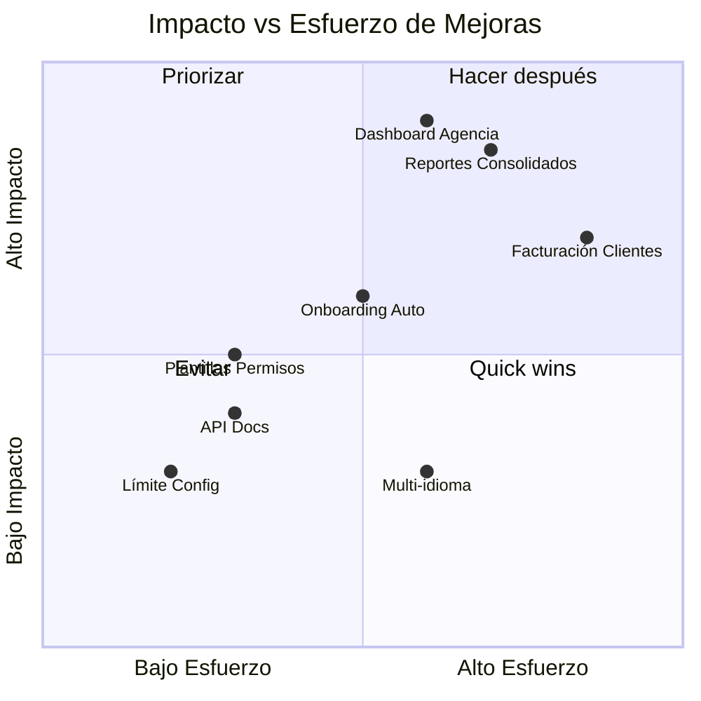

# Auditoría del Plan Agency - Quimera.ai

## Resumen Ejecutivo

El **Plan Agency** ($129 USD/mes) está diseñado para agencias digitales que gestionan múltiples clientes. Es el plan más completo antes de Enterprise y ofrece capacidades únicas de white-label y multi-tenancy.

---

## Estructura Actual del Plan

### Precio
| Ciclo | Precio | Ahorro |
|-------|--------|--------|
| Mensual | $129 USD | - |
| Anual | $99 USD/mes ($1,188/año) | ~$360/año (23%) |

### Límites de Recursos

| Recurso | Cantidad | Comparación con Pro ($49) |
|---------|----------|---------------------------|
| Proyectos | 50 | +150% (Pro: 20) |
| Usuarios | 25 | +150% (Pro: 10) |
| AI Credits/mes | 5,000 | +233% (Pro: 1,500) |
| Almacenamiento | 200 GB | +300% (Pro: 50 GB) |
| Dominios | 50 | +900% (Pro: 5) |
| Leads | 25,000 | +400% (Pro: 5,000) |
| Productos E-commerce | 1,000 | +900% (Pro: 100) |
| Emails/mes | 25,000 | +400% (Pro: 5,000) |
| **Sub-clientes** | **10** | **Exclusivo** |

### Features Exclusivas vs Pro

| Feature | Pro | Agency |
|---------|-----|--------|
| White-Label Completo | ❌ | ✅ |
| Multi-Tenant (Sub-clientes) | ❌ | ✅ |
| CRM Automations | ❌ | ✅ |
| Chatbot Personalización Avanzada | ❌ | ✅ |
| Chatbot Multi-Canal | ❌ | ✅ |
| API Access | ❌ | ✅ |
| Portal de Cliente Personalizado | ❌ | ✅ |
| Soporte Prioritario | Chat | Prioritario |
| E-commerce Transaction Fee | 2% | 1% |

---

## Análisis de Funcionalidades Clave

### 1. Sistema White-Label

**Ubicación del código:** 
- [BrandingSettings.tsx](file:///Users/armandoolmo/QuimeraAppCursor/QuimeraAi/components/dashboard/tenant/BrandingSettings.tsx)
- [multiTenant.ts](file:///Users/armandoolmo/QuimeraAppCursor/QuimeraAi/types/multiTenant.ts)

**Capacidades actuales:**
- Logo personalizado
- Colores primarios/secundarios
- Favicon personalizado
- Nombre de empresa
- Dominio personalizado
- Email "from" personalizado
- Footer personalizado
- Email/URL de soporte

**Estado:** ✅ Implementado y funcional

---

### 2. Sistema Multi-Tenant (Sub-clientes)

**Ubicación del código:**
- [TenantContext.tsx](file:///Users/armandoolmo/QuimeraAppCursor/QuimeraAi/contexts/tenant/TenantContext.tsx)
- Componentes del portal en [/components/portal/](file:///Users/armandoolmo/QuimeraAppCursor/QuimeraAi/components/portal/)

**Capacidades actuales:**
- Crear hasta 10 sub-clientes
- Workspaces aislados por cliente
- Portal white-label para cada cliente
- Sistema de roles: `agency_owner`, `agency_admin`, `agency_member`, `client`
- Permisos granulares por rol

**Estado:** ✅ Implementado y funcional

---

### 3. Roles y Permisos

```
┌─────────────────┬─────────────────────────────────────────┐
│ Rol             │ Permisos                                │
├─────────────────┼─────────────────────────────────────────┤
│ agency_owner    │ Control total (billing, settings, todo) │
│ agency_admin    │ Gestionar proyectos, miembros, contenido│
│ agency_member   │ Editar proyectos y contenido asignado   │
│ client          │ Solo su propio contenido y métricas     │
└─────────────────┴─────────────────────────────────────────┘
```

---

## Propuesta de Valor para el Usuario

### ¿Para quién es ideal?

1. **Agencias de Marketing Digital** - Gestionan sitios y campañas para múltiples clientes
2. **Freelancers con cartera de clientes** - Necesitan separar proyectos por cliente
3. **Consultoras** - Ofrecen servicios digitales como paquete
4. **Desarrolladores/Diseñadores** - Revenden servicios white-label

### Beneficios concretos

| Beneficio | Impacto |
|-----------|---------|
| White-label | Presentar como tu propia plataforma |
| 10 sub-clientes | ~$12.90/cliente (costo por cliente) |
| Portal personalizado | Clientes acceden con tu marca |
| API Access | Integraciones personalizadas |
| Soporte prioritario | Respuestas más rápidas |

---

## Recomendaciones de Mejora

### 🔴 Alta Prioridad

#### 1. **Dashboard de Agencia Dedicado**
> [!IMPORTANT]
> Actualmente no existe una vista unificada para que la agencia vea todos sus sub-clientes de un vistazo.

**Propuesta:**
- Vista general con métricas de todos los clientes
- Alertas de uso de recursos por cliente
- Renovaciones próximas
- Actividad reciente por cliente

---

#### 2. **Reportes Consolidados**
> [!WARNING]
> No hay forma de generar reportes que agreguen datos de múltiples clientes.

**Propuesta:**
- Reporte mensual de actividad (todos los clientes)
- Exportación PDF/Excel con branding de agencia
- Métricas: leads, visitas, ventas por cliente
- Comparativas entre clientes

---

### 🟡 Media Prioridad

#### 3. **Facturación a Clientes**
**Estado actual:** No hay sistema de cobro a sub-clientes.

**Propuesta:**
- Permitir a agencias cobrar directamente a sus clientes
- Stripe Connect para facturación delegada
- Márgenes configurables por cliente

---

#### 4. **Plantillas de Permisos**
**Estado actual:** Los permisos se configuran manualmente para cada miembro.

**Propuesta:**
- Plantillas predefinidas (ej: "Solo edición blog", "Solo CRM")
- Permisos a nivel de proyecto (no solo rol global)

---

#### 5. **Onboarding de Sub-cliente Automatizado**
**Estado actual:** La creación de sub-clientes es manual.

**Propuesta:**
- Formulario de intake para nuevos clientes
- Auto-provisión de workspace con plantilla
- Welcome email automático con credenciales

---

### 🟢 Baja Prioridad

#### 6. **Límite de Sub-clientes Configurable**
**Estado actual:** Fijo en 10 sub-clientes.

**Propuesta:**
- Add-on para más sub-clientes ($X/cliente adicional)
- O crear "Agency Plus" con 25 sub-clientes

---

#### 7. **API de Gestión de Tenants**
**Estado actual:** API access está incluida pero no está clara la documentación de endpoints de tenant management.

**Propuesta:**
- Documentar endpoints para CRUD de sub-clientes
- Webhooks para eventos de tenant

---

#### 8. **Multi-idioma para Portales**
**Estado actual:** El idioma del portal sigue la configuración del tenant padre.

**Propuesta:**
- Permitir configurar idioma por sub-cliente
- Traducciones automáticas del contenido del portal

---

## Análisis de Precios

### Comparación con Competencia

| Plataforma | Plan Similar | Precio | Sub-clientes |
|------------|-------------|--------|--------------|
| **Quimera Agency** | $129/mes | 10 |
| Webflow (Teams) | $49/mes | 0 (no multi-tenant) |
| GoHighLevel Agency | $297/mes | Ilimitados |
| Duda Agency | $174/mes | 4 incluidos |
| Squarespace Enterprise | Custom | Custom |

### Recomendación de Pricing

> [!TIP]
> El precio actual ($129) es competitivo para el segmento de agencias pequeñas/medianas. 
> 
> **Oportunidad:** Crear un tier "Agency Plus" a ~$199 con:
> - 25+ sub-clientes
> - Reports consolidados
> - Onboarding automatizado
> - SLA de soporte mejorado

---

## Métricas Sugeridas para Tracking

Para evaluar el éxito del plan Agency, sugiero trackear:

1. **Adopción**
   - % de usuarios que suben de Pro a Agency
   - Razón principal de upgrade (survey)
   - Churn rate específico de Agency

2. **Uso**
   - Promedio de sub-clientes creados por cuenta Agency
   - % de cuentas que usan white-label activamente
   - Uso de API (si tienen access)

3. **Satisfacción**
   - NPS específico de usuarios Agency
   - Tickets de soporte por cuenta
   - Features más solicitadas

---

## Resumen de Mejoras por Impacto



---

## Conclusión

El Plan Agency tiene una base sólida con funcionalidades clave bien implementadas (white-label, multi-tenant, roles). Las principales oportunidades de mejora están en:

1. **Visibilidad:** Dashboard y reportes consolidados
2. **Automatización:** Onboarding de clientes
3. **Monetización:** Facturación a sub-clientes

Estas mejoras aumentarían significativamente el valor percibido y la diferenciación vs competencia, justificando potencialmente un tier "Agency Plus" premium.

---

*Auditoría realizada el 12 de enero de 2026*
